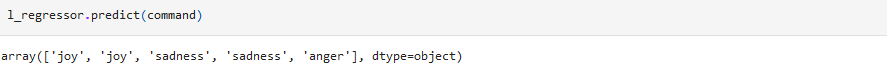
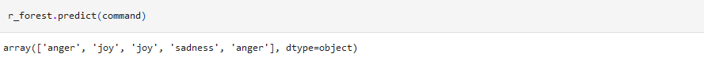

# NLP ile Duygu Analizi

Bu çalışmamızda NLP algoritmasını kullanarak verilmiş olan bir metinden kişinin duygusal analizini tespit etmeye çalışıcaz.Peki ya NLP algoritması nedir ?

Natural Language Processing(Doğal dil işleme) algoritması bilgisayarların insanların konuştuğu veya yazdığı doğal dili anlamaları ve işlemeleri için kullanılan bir disiplindir. Genellikle yorum,metin,görüntü işleme, kelime tamamlama, duygu analizi,soru cevaplama gibi alanlarda kullanılan yöntemdir.

## Requirements

- python3

- pip3 install -r requirements.txt

## Data Set

Veri setindeki labellar hakkında bilgilendirme amaçlı grafik. 

## Text Analysis

#### N-Gram 
Metin içerisindeki verileri küçük ve ardışık olarak kelime gruplarına böler.Belirlenen sayı kadar kelimeleri kombine eder.Kısacası bu grupların sıklığına veya sırasına dayalı olarak analizlere olanak tanır.

#### Part of Speech (POS) tagging
Metinde geçen kelimelerin "sıfat,zarf,fiil,isim" gibi özelliklerini çıkartır. Amaç dil bilgisi anlamında etiketleme yapmaktır.

#### Chunking
POS işleminden sonra dilbilgisel(sıfat.zarf,isim vs.) kategoriye ayrılmış olan kelimeleri gruplara ayırır. Genellikle tag'lerin grafiksel gösteriminde kullanılır.

#### Named Entity Recognition
Bu analiz tekniğinin ana amacı , metin verilerini anlamlandırıp,yapılandırarak metin içerisindeki özel isimleri ayırt edip sınıflandırmaktır.

## Results

En iyi sonuc count vectors kullanılarak Random Forest algoritması seçildi.

## Example Forecast

Üzerinde tahmin yapılacak yorum metni

## Naive Bayes

## Logistic Regression

## Random Forest

## Contact

 Beni [LinkedIn](https://www.linkedin.com/in/muhammed-talha-bıçak) üzerinden takip edebilirsiniz.

 GitHub üzerinden takip edebilir ve mesaj gönderebilirsiniz: [@talha-bicak](https://github.com/talha-bicak)

